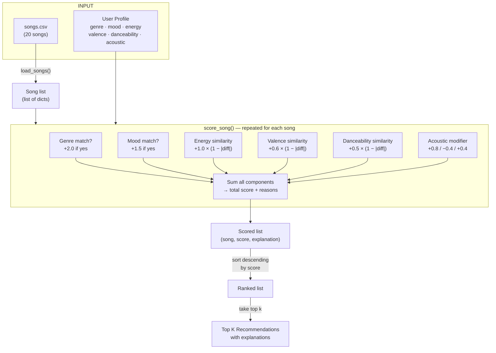
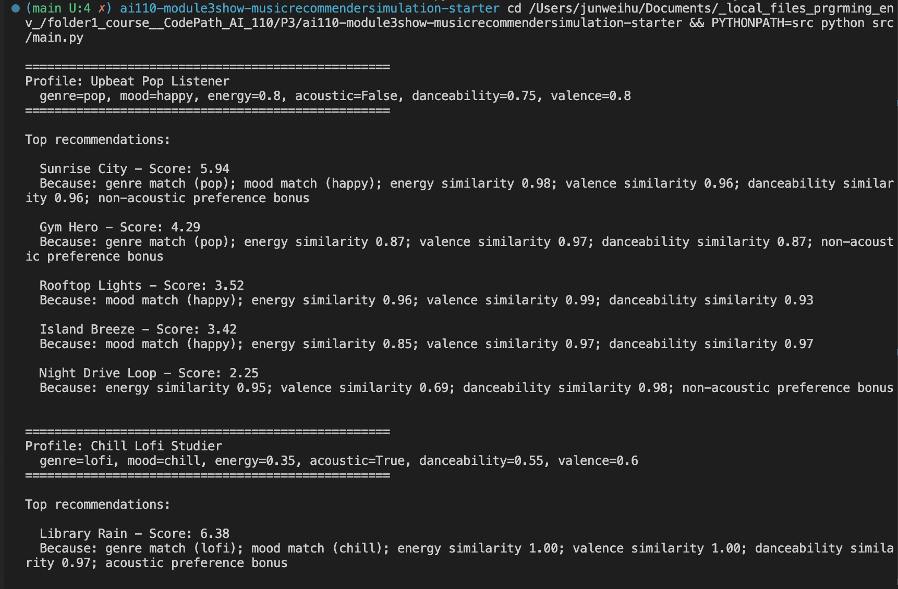
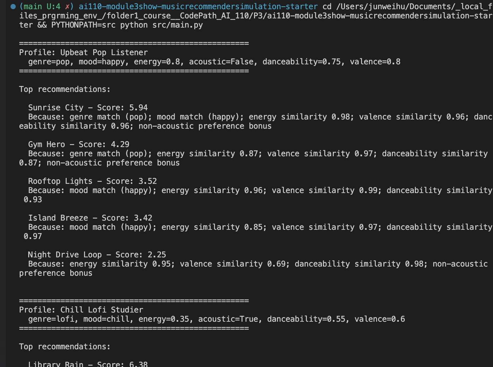

# 🎵 Music Recommender Simulation

## Project Summary

In this project you will build and explain a small music recommender system.

Your goal is to:

- Represent songs and a user "taste profile" as data
- Design a scoring rule that turns that data into recommendations
- Evaluate what your system gets right and wrong
- Reflect on how this mirrors real world AI recommenders

Replace this paragraph with your own summary of what your version does.

---

## How The System Works

Real-world music recommenders like Spotify and YouTube Music use collaborative filtering (what similar users listen to) and content-based filtering (audio features of the songs themselves) to rank thousands of tracks for each listener. They analyze signals like play history, skips, saves, and audio attributes such as tempo, energy, and valence to build a model of each user's taste. Our simulation focuses on the content-based side: we define a user's taste as a small set of explicit preferences and score every song in a catalog by how well its attributes match those preferences. This keeps the system transparent and explainable — every recommendation can point to the exact features that drove it.

### Song features used

Each `Song` object carries the following attributes that feed into scoring:

- **genre** — categorical label (e.g. pop, rock, jazz)
- **mood** — categorical label (e.g. happy, sad, chill)
- **energy** — float 0–1, how intense the track feels
- **tempo_bpm** — beats per minute
- **valence** — float 0–1, musical positivity
- **danceability** — float 0–1, how suitable for dancing
- **acousticness** — float 0–1, how acoustic vs. electronic

### UserProfile preferences

Each `UserProfile` stores:

- **favorite_genre** — the genre the user prefers most
- **favorite_mood** — the mood the user gravitates toward
- **target_energy** — the energy level the user enjoys (float 0–1)
- **likes_acoustic** — boolean flag for acoustic preference

### Scoring and ranking

The recommender scores each song by comparing its features against the user profile — awarding points for genre and mood matches and penalizing large gaps in energy and acousticness. Songs are ranked by total score and the top *k* are returned, each with a plain-language explanation of why it was chosen.

### Algorithm Recipe

Each song is scored by summing six weighted components:

| # | Component | Type | Weight | Rule |
|---|-----------|------|--------|------|
| 1 | **Genre match** | Categorical | **+2.0** | Full points if `song.genre == user.favorite_genre`, else 0 |
| 2 | **Mood match** | Categorical | **+1.5** | Full points if `song.mood == user.favorite_mood`, else 0 |
| 3 | **Energy similarity** | Continuous | **+1.0** | `1.0 × (1 − |song.energy − user.target_energy|)` |
| 4 | **Valence similarity** | Continuous | **+0.6** | `0.6 × (1 − |song.valence − user.target_valence|)` |
| 5 | **Danceability similarity** | Continuous | **+0.5** | `0.5 × (1 − |song.danceability − user.target_danceability|)` |
| 6 | **Acoustic modifier** | Boolean | **+0.8 / −0.4** | If user `likes_acoustic`: +0.8 when acousticness >= 0.6, −0.4 when < 0.3. If user does not: +0.4 when acousticness < 0.3 |

**Why these weights?** Genre is the strongest taste signal (people self-identify as "a rock fan" or "a pop listener"), so it gets the highest weight at 2.0. Mood is important but more context-dependent (the same person might want "chill" at night and "intense" at the gym), so it sits at 1.5. The continuous features (energy, valence, danceability) act as fine-grained tiebreakers that separate songs within the same genre/mood bucket. Acousticness is a binary modifier rather than a similarity score because listeners tend to have a clear preference for acoustic or electronic — there is less of a gradient.

**Max theoretical score: ~6.4** (genre + mood + perfect similarity on all three continuous features + acoustic bonus).

### Expected Biases and Limitations

- **Genre dominance.** At +2.0, a genre match is worth more than mood + energy combined. A pop song with the wrong mood (e.g., "Gym Hero" — pop/intense) can outscore a perfect-mood song from another genre. This mirrors how real recommenders create "genre bubbles" that limit discovery.
- **Exact-match-only for categorical features.** "indie pop" and "pop" are treated as completely different genres, scoring 0 instead of partial credit. Similarly, "chill" and "relaxed" get no cross-match despite being semantically close. This penalizes songs that are near-matches in mood or genre.
- **No personalization over time.** The profile is static — there is no learning from feedback, skip behavior, or listening history. A real user's taste shifts by time of day, activity, and social context, none of which this system captures.
- **Small catalog bias.** With only 20 songs, some genres have just one representative. A user who prefers "classical" will always get "Rainy Window" at #1 with no meaningful alternatives, making the ranking trivially determined by the catalog rather than the algorithm.
- **Energy-range blindness.** The continuous similarity formula treats a 0.1 difference the same regardless of where it falls on the scale. A song at 0.90 energy vs. a target of 0.80 feels quite different from 0.50 vs. 0.40, but both score identically.

### Data Flow Diagram



### Sample Output

Below is the terminal output showing recommendations for all three user profiles (Pop Listener, Lofi Studier, Rock Fan) with song titles, scores, and scoring reasons:



### Edge-Case / Adversarial Profiles Output

Below is the terminal output including the three adversarial profiles (High-Energy Sad, K-Pop Fan with missing genre, Middle-of-the-Road) that stress-test the scoring logic:



---

## Getting Started

### Setup

1. Create a virtual environment (optional but recommended):

   ```bash
   python -m venv .venv
   source .venv/bin/activate      # Mac or Linux
   .venv\Scripts\activate         # Windows

2. Install dependencies

```bash
pip install -r requirements.txt
```

3. Run the app:

```bash
python -m src.main
```

### Running Tests

Run the starter tests with:

```bash
pytest
```

You can add more tests in `tests/test_recommender.py`.

---

## Experiments You Tried

### Weight-Shift Experiment: Genre halved (2.0 → 1.0), Energy doubled (1.0 → 2.0)

**Hypothesis:** Reducing genre dominance and increasing energy sensitivity will break genre bubbles and produce more energy-aware rankings.

**Key results:**

- **Pop Listener:** "Rooftop Lights" (indie pop) jumped from #4 to #2 — its energy similarity (0.96) became more valuable than "Gym Hero's" genre match. Genre bubble partially broken.
- **Rock Fan:** "Drop the Bass" (electronic) entered the top 5 for the first time — its energy (0.95) is near the target (0.92), and the doubled weight pushed it past mood-matched songs.
- **Middle-of-the-Road:** Lofi/chill songs overtook pop songs in the top 3. With energy doubled, songs closer to 0.50 energy rose regardless of genre.

**Conclusion:** The recommendations were *different* but not objectively *more accurate*. The experiment showed that weight tuning is a value judgment — it decides whether genre identity or acoustic feel defines a user's taste. The original weights were reverted after the experiment.

---

## Limitations and Risks

- **Genre dominance creates filter bubbles.** At +2.0, a genre match alone can outweigh a perfect mood+energy fit from another genre. Users are unlikely to discover songs outside their stated genre.
- **Exact-match categoricals.** "Indie pop" ≠ "pop" and "chill" ≠ "relaxed" — semantically similar values get zero partial credit.
- **Tiny catalog (20 songs).** Some genres have only one song, making rankings trivially determined by catalog size rather than algorithmic quality.
- **No learning or context.** The profile is static — no feedback loop, no time-of-day awareness, no listening history.
- **Conflicting preferences are poorly handled.** The High-Energy Sad profile got a quiet classical track because genre+mood overwhelmed the energy mismatch.

See [model_card.md](model_card.md) for a deeper analysis.

---

## Reflection

**[Model Card](model_card.md)** — full evaluation, strengths, limitations, bias analysis, and future work.

**[Reflection](reflection.md)** — detailed profile-pair comparisons explaining what changed between outputs and why.

Building this recommender showed how a simple weighted sum can produce surprisingly convincing results — but also how fragile those results are. The entire ranking hinges on a handful of weight values chosen by the developer, not learned from data. Changing genre from 2.0 to 1.0 reshuffled every profile's top 5, and neither version was objectively "correct." This is the core lesson: recommenders do not discover truth, they encode a designer's assumptions about what matters.

Bias enters most subtly through omission. The catalog has no K-pop, Latin, or Afrobeat — so users who prefer those genres get demoted to a fallback path with compressed, low-confidence scores. The mood labels were assigned by one person, reflecting a single cultural lens on what "happy" or "intense" means. And the exact-match design means semantically similar categories (chill vs. relaxed, indie pop vs. pop) are treated as completely unrelated. In a real product, these design choices would quietly shape what millions of listeners are exposed to — and what they never hear.


---

## 7. `model_card_template.md`

Combines reflection and model card framing from the Module 3 guidance. :contentReference[oaicite:2]{index=2}  

```markdown
# 🎧 Model Card - Music Recommender Simulation

## 1. Model Name

Give your recommender a name, for example:

> VibeFinder 1.0

---

## 2. Intended Use

- What is this system trying to do
- Who is it for

Example:

> This model suggests 3 to 5 songs from a small catalog based on a user's preferred genre, mood, and energy level. It is for classroom exploration only, not for real users.

---

## 3. How It Works (Short Explanation)

Describe your scoring logic in plain language.

- What features of each song does it consider
- What information about the user does it use
- How does it turn those into a number

Try to avoid code in this section, treat it like an explanation to a non programmer.

---

## 4. Data

Describe your dataset.

- How many songs are in `data/songs.csv`
- Did you add or remove any songs
- What kinds of genres or moods are represented
- Whose taste does this data mostly reflect

---

## 5. Strengths

Where does your recommender work well

You can think about:
- Situations where the top results "felt right"
- Particular user profiles it served well
- Simplicity or transparency benefits

---

## 6. Limitations and Bias

Where does your recommender struggle

Some prompts:
- Does it ignore some genres or moods
- Does it treat all users as if they have the same taste shape
- Is it biased toward high energy or one genre by default
- How could this be unfair if used in a real product

---

## 7. Evaluation

How did you check your system

Examples:
- You tried multiple user profiles and wrote down whether the results matched your expectations
- You compared your simulation to what a real app like Spotify or YouTube tends to recommend
- You wrote tests for your scoring logic

You do not need a numeric metric, but if you used one, explain what it measures.

---

## 8. Future Work

If you had more time, how would you improve this recommender

Examples:

- Add support for multiple users and "group vibe" recommendations
- Balance diversity of songs instead of always picking the closest match
- Use more features, like tempo ranges or lyric themes

---

## 9. Personal Reflection

A few sentences about what you learned:

- What surprised you about how your system behaved
- How did building this change how you think about real music recommenders
- Where do you think human judgment still matters, even if the model seems "smart"

